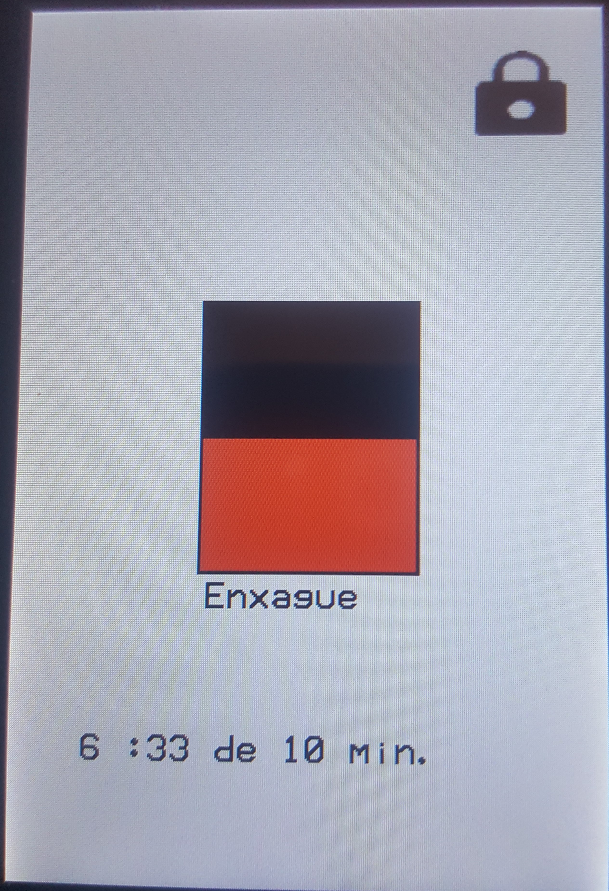

# Embarcados-LavaRoupa

Interface de uma máquina de lavar roupa usando o microcontrolador SAM E70 e uma tela LCD touch

Guilherme Leite - guilhermepl3@al.insper.edu.br

Demonstração: https://youtu.be/hX0H028hX4E

Interface :

